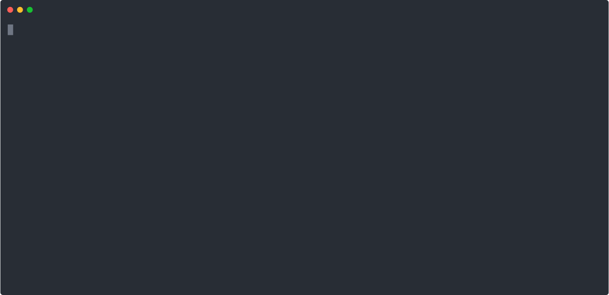

# aspiratv

Ce programme interroge les serveurs de télévision de rattrapage et télécharge les émissions souhaitées et les enregistre sur un disque selon une organisation reconnue par des programmes comme [PLEX](https://www.plex.tv/) ou [EMBY](https://emby.media/). Les métadonnées (titre des émissions, desciption, vignettes) sont placées de façon à être directement reconnues par Emby (à tester dans Plex).


## Télécharger un programme, une série
<p align="center">
  
</p>

``` sh
./aspiratv --provider=artetv --destination=$HOME/Videos/DL download "La minute vieille"
```

## Télécharger les dernières diffusions à partir d'une liste
<p align="center">
  
</p>

``` sh
./aspiratv
```
Cette commande vérifie les serveurs et télécharge les épisodes qui ne le sont pas encore.


## :warning: Avertissement :warning: 
Les contenus mis à disposition par les diffuseurs sont soumis aux droits d'auteur. Ne les utilisez pas en dehors du cadre privé.

Aspiratv ne fait que garder une copie de l’œuvre sur votre disque dur, comme vous l'auriez fait avec votre enregistreur vidéo, votre box TV ou une clé USB branchée sur votre TV. Cette opération est seulement rendue plus simple qu'en gérant manuellement les enregistrements.

Le fonctionnement de ce programme n'est pas garanti. Notamment, les fournisseurs de contenus sont susceptibles de changer leurs APIs ou interdire leur utilisation sans pré-avis. 

## Rendu dans Emby

<p align="center">

</p>


# Installation

## Prérequis

- FFMPEG: ffmpeg est utilisé pour convertir le flux vidéo en fichiers mp4. l'exécutable doit être disponible dans votre système. Page de téléchargement pour Windows: [https://ffmpeg.zeranoe.com/builds/](https://ffmpeg.zeranoe.com/builds/)

## Installation des binaires
Les binaires pour Windows, Linux et FreeBSD sont directement disponibles sur la page [releases](https://github.com/simulot/aspiratv/releases/latest). Les binaires n'ont pas de dépendance autre que FFMPEG et n'ont pas besoin d'être installés.

### linux
- Télécharger les binaires correspondant à votre système sur la page de la dernière release de le répertoire de votre choix.
- Puis décompresser l'archive
```
tar -czvf aspiratv_0.8.0_Linux_x86_64.tar.gz
```


# Ligne de commande

```
Usage of aspiratv:
      --config string        Configuration file name. (default "config.json")
  -d, --destination string   Destination path.
      --force                Force media download.
      --headless             Headless mode. Progression bars are not displayed.
  -b, --keep-bonuses         Download bonuses when true (default true)
      --log string           Give the log file name.
  -l, --log-level string     Log level (INFO,TRACE,ERROR,DEBUG) (default "ERROR")
  -a, --max-aged int         Retrieve media younger than MaxAgedDays.
  -m, --max-tasks int        Maximum concurrent downloads at a time. (default 8)
  -p, --provider string      Provider to be used with download command. Possible values : artetv,francetv,gulli
  -n, --write-nfo            Write NFO file for KODI,Emby,Plex... (default true)
```
Le programme fonctionne selon deux modilités :
## Pour surveiller la mise à disposition de nouveaux épisodes d'une émission
Dans ce mode, le fichiers de configuration `config.json` placé dans le même répertoire que le programe est lu pour pour interroger les différents serveur.

### --headless
L'option `--headless` désactive les barres de progressions et produit une log sur la console.


Note: L'option -server a été supprimée. Pour interroger automatiquement les serveur, ajouter une ligne dans crontab, ou une tâche planifiée dans windows.

### --config votreconfig.json

L'option `--config` indique le fichier de configuration à utiliser.

## Pour télécharger une émission, ou une série
```sh
./aspiratv -provider=francetv -destination=$HOME/Videos/DL download "Les Dalton"
```
Cette commande cherchera les épisodes de la série "Les Dalton" sur france télévisions, et les téléchargera dans le répertoire ~/Video/DL


## Les options communes aux deux modes :

### --max-tasks NUM
Précise le nombre maximal de téléchargements simultanés possible. La valeur par défaut est le nombre de processeurs de la machine.

### --log-level, -l
Indique le niveau de détail du fichier de log. Les options possibles sont:
* INFO 
* TRACE  
* DEBUG


### --log LOG_FILE

L'option `--log` indique le fichier dans lequel les messages d'erreur sont écrits. 

### --force
Télécharge toutes les émissions correspondant à la liste de recherche, même si elles ont été déjà téléchargées.


### --keep-bonuses
Télécharge les vidéos associées au show demandé.

### --max-aged DAYS
Ne télécharge que les émissions qui ont été diffusées moins de DAYS jours. Cette option est utile quand vous téléchargez une émission quotidienne par exemple.


# Configuration

## fichier **config.json**

Le fichier config.json contient les paramètres et la liste des émissions que l'on souhaite télécharger :

``` json
{
  "Destinations": {
    "Documentaires": "${HOME}/Videos/Documentaires",
    "Jeunesse": "${HOME}/Videos/Jeunesse",
    "Séries": "${HOME}/Videos/Series",
    "News": "${HOME}/Videos/News"
  },
  "Providers": {
    "artetv": {
      "Enabled": false        
    },
    "gulli":{
      "Enabled": true,
    },
    "francetv":{
        "Enabled": true
    }
  },
  "WatchList": [
    {
      "Show": "Doctor Who", 
      "Title": "",
      "Pitch": "",
      "Provider": "francetv",
      "Destination": "Séries"
    },
    {
      "Show": "Oggy et les cafards",
      "Pitch": "",
      "Provider": "gulli",
      "Destination": "Jeunesse"
    },

  ]
}
```

### Destinations
Défini les répertoires de destination des fichiers. A noter que les variables d'environnement peuvent être utilisées.

### WatchList
Donne la liste des critères de recherche pour sélectionner les émissions à télécharger. L'ensemble des critères non vides doit être satisfait. Ils sont évalués dans l'ordre suivant :
1. Provider: code du fournisseur de contenu
1. Show : nom de l'émission
1. Title: titre de l'émission ou de l'épisode
1. Pitch: description de l'émission
Le contenu du critère doit être contenu dans le champ correspondant obtenu sur le serveur de la télévision.

* Destination: code du répertoire où les fichiers doivent être téléchargés, dont la définition est placée dans la section  **Destinations**

Chaque provider peut traiter spécifiquement les recherches. 

# Les fournisseurs de contenu : les providers
Un provider est un package du logiciel permettant d'implémenter les différents connecteurs.
Les connecteurs disponibles sont :
## France Télévision (`francetv`):
  Ce connecteur permet de surveiller les programmes en replay des chaînes France 2, France 3, France 4, France 5, France Ô, et La 1ère.
## Arte France (`artetv`) :
  Ce connecteur permet de surveiller les programmes de la chaîne Arte
  
  Les playlists Arte peuvent être surveillées pour que les nouveaux épisodes soit téléchargés dès leur disponibilité. 
## Gulli (`gulli`)
  Ce connecteur permet de surveiller les programmes de la chaîne Gulli. Attention Gulli tronque le nom des shows. Il convient de paramétrer les recherches avec les noms tronqués. 

# Configuration de Emby

Créez une médiathèque de type "TV". Les réglages par défaut conviennent bien. Les données pourront être complétés si la série est connue des sites tesl de ImDB,Fanart...


# Configuration de PLEX

Pour obtenir un résultat acceptable, il faut configurer une librairie de type "Séries TV" en utilisant l'agent "Personal Media Shows" afin que plex utilise les titres et les imagettes téléchargées depuis le serveur de la télévision. Veillez à ce que l'agent "Local Media Assets (TV)" soit placé en tête de liste des agents pour les Séries / Personal Media Shows ([voir cette page](https://support.plex.tv/articles/200265256-naming-home-series-media/)) . 


# Compilation des sources
Vous devez avoir un compilateur pour [le langage GO](https://golang.org/dl/).


